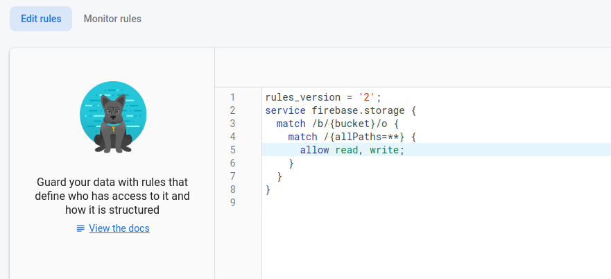
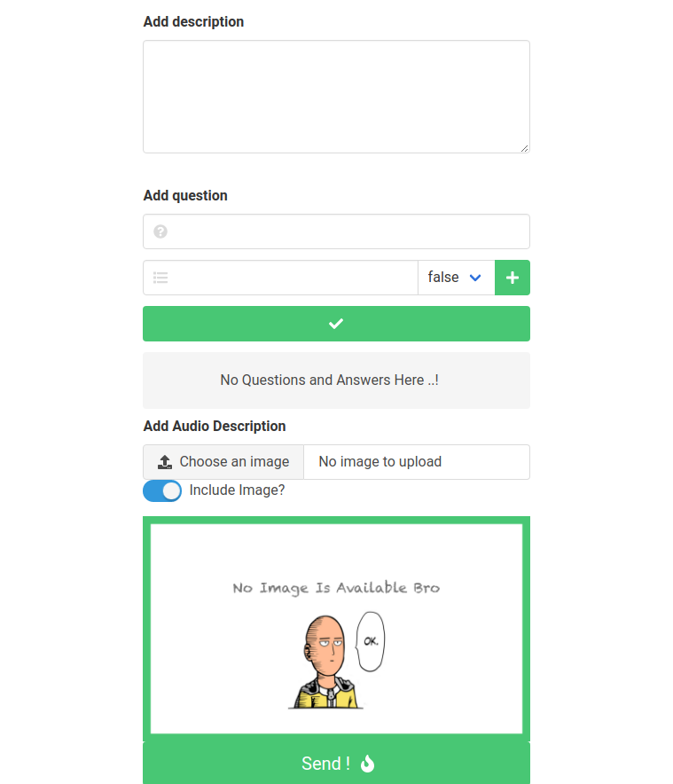

## Quiz Creator with Firebase


#### Clone and Install:
```bash
git clone https://github.com/zakaria-chahboun/quiz-creator-firebase-project.git
cd quiz-creator-firebase-project

npm install
```

### Run test:
```bash
npm run dev
```

### Upload Permistion

if you want to add images you have to set this Rules in firebase storage:


#### Screenshots:

firebase configuration fields


on empty


stastus notifications


Add section


---------------
by zaki
